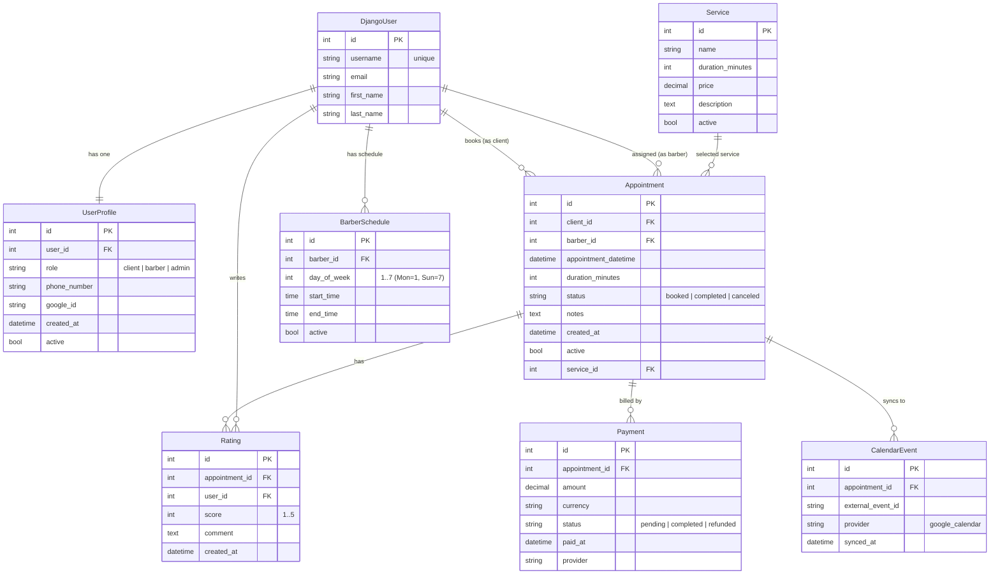

### Goal:

A full-stack barbershop booking platform where:

* Clients can view available barbers and services.
* Book, cancel, or reschedule appointments.
* Barbers manage their schedules.
* The system sends automatic reminders and real-time updates.

## SYSTEM ARCHITECTURE

* **Pattern:** MVC (using Django)
* **Framework:** Django REST Framework (DRF)
* **Frontend (optional):** React / Vue / simple Django templates
* **Database:** PostgreSQL
* **Auth:** Django + Google OAuth2
* **Containerization:** Docker + Docker Compose
* **Real-time:** Django Channels (WebSockets)
* **External API:** Google Calendar API or Twilio (SMS/WhatsApp reminders)
* **Deployment:** Render / Heroku / AWS (with CI/CD pipeline)

## CORE ENTITIES (at least 3 required)


| Entity                          | Description                           | Relationships                  |
| ------------------------------- | ------------------------------------- | ------------------------------ |
| **User**                        | Represents both customers and barbers | One-to-many with Appointment   |
| **Service**                     | Haircut, beard trim, etc.             | One-to-many with Appointment   |
| **Appointment**                 | Booking record (date, time, status)   | Foreign keys to User & Service |
| **BarberSchedule** *(optional)* | Defines barber working hours          | One-to-one with User (Barber)  |

## DATABASE SCHEMA (example)

### **User**

* id (PK)
* name
* email (unique)
* role (`CLIENT` / `BARBER` / `ADMIN`)
* phone\_number
* google\_id (for OAuth)
* created\_at

### **Service**

* id (PK)
* name (e.g. “Haircut”, “Beard Trim”)
* duration\_minutes
* price

### **Appointment**

* id (PK)
* user\_id (FK → User)
* barber\_id (FK → User)
* service\_id (FK → Service)
* appointment\_date (DateTime)
* status (`BOOKED`, `CANCELED`, `COMPLETED`)
* notes

### **BarberSchedule**

* id (PK)
* barber\_id (FK → User)
* day\_of\_week
* start\_time
* end\_time

### DIAGRAMAS



## MAIN FEATURES / ENDPOINTS (REST API)


| Feature                         | Method                | Endpoint                         | Description              |
| ------------------------------- | --------------------- | -------------------------------- | ------------------------ |
| Register / Login (Google OAuth) | `POST`                | `/auth/google/`                  | Login via Google         |
| CRUD Services                   | `GET/POST/PUT/DELETE` | `/api/services/`                 | Manage haircut types     |
| CRUD Barbers                    | `GET/POST`            | `/api/barbers/`                  | Manage barbers           |
| Book Appointment                | `POST`                | `/api/appointments/`             | Client books appointment |
| View Appointments               | `GET`                 | `/api/appointments/?user_id=`    | View all bookings        |
| Cancel Appointment              | `PATCH`               | `/api/appointments/{id}/cancel/` | Change status            |
| Real-time updates               | WebSocket             | `/ws/appointments/`              | Notify on status change  |

## REAL-TIME FEATURES (Django Channels)

Use **Django Channels** for WebSocket communication:

* Notify barbers instantly when a new appointment is booked.
* Notify clients when appointment status changes (confirmed, canceled).

Example flow:

```markdown
Client books appointment → WebSocket message → Barber dashboard updates live.

```

## EXTERNAL API INTEGRATION

### Option 1: **Google Calendar API**

Sync appointments with barber’s Google Calendar.

* When a booking is created, send an event to Google Calendar.
* When canceled, delete it.

### Option 2: **Twilio API**

Send SMS or WhatsApp reminders:

* “Hey Salvador, your haircut is tomorrow at 10:00 AM ✂️.”

## AUTHENTICATION

Use **Django-allauth** or **dj-rest-auth** for:

* JWT-based authentication for API calls
* Google OAuth2 (social login)

Example:

```python
/auth/google/login/
/auth/token/refresh/

```

## BONUS IDEAS

* Add **ratings and reviews** for barbers.
* Add **payment integration (Stripe)** for booking deposits.
* Add **analytics dashboard** for admin (most booked service, busiest day).
